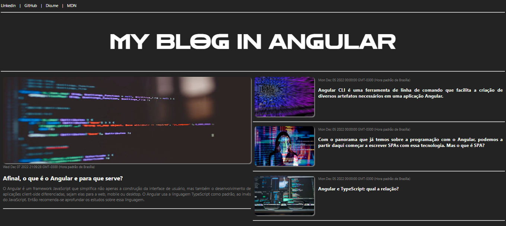

# Primeiro Blog com Angular

A proposta desse desafio foi criar uma aplicação de blog funcional, construir componentes inteligentes e organizar um projeto Angular utilizando as ferramentas que o próprio framework oferece.

## 🎮 Tecnologias utilizadas:

  - HTML
  - CSS
  - TypeScript
  - Angular
  - Git e GitHub

### 🤳 Contato

[Me econtre no Linkedin 🔗](https://www.linkedin.com/in/cristiemim9/)

### 💌 Agradecimentos

À toda equipe da DIO e da NTT Data pela oportunidade de adiquirir tanto conhecimento e imergir no mundo tecnológico, e principalmente ao Felipe Aguiar, que dividiu seu conhecimento de forma lúdica e de fácil entendimento. Obrigada por facilitar os estudos e tornar mais leve e divertido! Então... bora codar!! 
